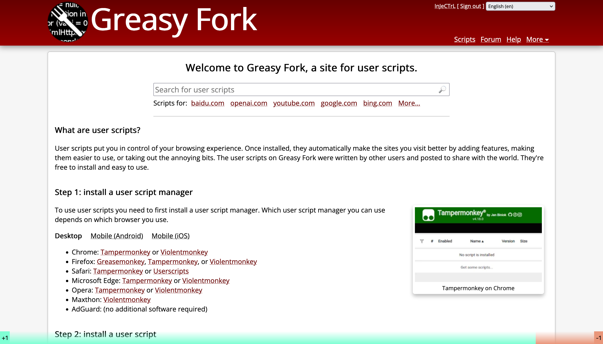

# Website-Rating
A Tampermonkey script helps you rate any websites and share the score.

## Introduction
Show public rating of the website on a bottom-bar.

Green bar indicates good or recommend, the red one means bad or not recommend.

Rate the website by clicking '+1' or '-1' button on left-bottom and right-bottom.



## Installation
You should have Tampermonkey installed at first.

Then install the script from [GreasyFork](https://greasyfork.org/zh-CN/scripts/464809-website-rating).

## Infrastructure Design


The script gets and sets rating data from 2 Lambda functions, and the two functions will read and write a single DynamoDB table.

There will be 4 attributes in the DynamoDB table, details below:
1. host (Primary Key): Domain of the website. For instance, host of `https://stackoverflow.co/teams/` is `stackoverflow.co`.
2. good: Count of +1 score.
3. bad: Count of -1 score.
4. submitted: It's a list consists of users' IP who have submitted their +1 or -1 rating.

`Set Rating Lambda` will check if the user's IP in submitted list. If so, the rating operation is rejected. Otherwise, record the remote IP into `submitted` list, then modify `good` or `bad` value.

For the WebAPI URLs, the 2 lambda functions will expose their own lambda URL, they are invoked by Tampermonkey script.

## Build Requirement
- Python 3.9
- AWS CLI
- AWS SDK
- AWS CDK
- AWS Account

## Deploy AWS infrastructure
Make sure you have configured the AWS account and AWS CLI.

From the `cdk` directory, run:
```shell
cdk deploy
```

## Plans

- [x] Rate websites by clicking +1 and -1 buttons.
- [ ] Bypass CSP on some websites.
- [ ] Show rating score clearly.
- [ ] Introduce public comments to bring more information.


## WebAPI Schema
1. Invoke `getWebsiteRatingLambda`

    - Method: `POST`

    - URL: `{lambda function url}`

    - Request schema:
        ```json
        {
            "host": "xxx"
        }
        ```
    
    - Response schema:
        ```json
        {
            "host": "xxx",
            "good": 0,
            "bad": 0,
            "msg": "xxx"
        }
        ```
        If the it error occurs, the HTTP status code will be `400`, and there will be `msg` field inside response body.

2. Invoke `setWebsiteRatingLambda`
   
   - Method: `POST`

    - URL: `{lambda function url}`

    - Request schema:
        ```json
        {
            "host": "xxx",
            "operation": "+/-"
        }
        ```
    
    - Response schema:
        ```json
        {
            "host": "xxx",
            "good": 0,
            "bad": 0,
            "msg": "xxx"
        }
        ```
        If the it error occurs, the HTTP status code will be `400`, and there will be `msg` field inside response body.